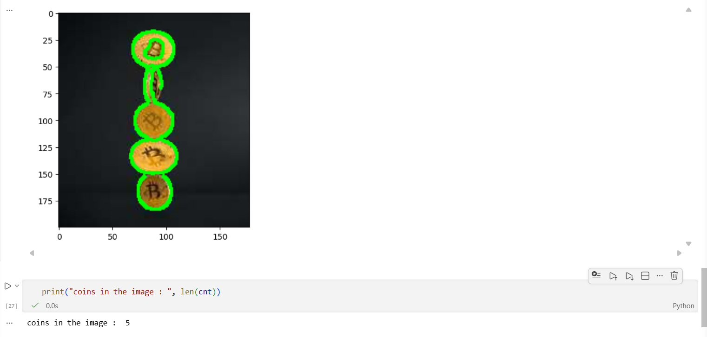

# Count Objects in Image using OpenCV

## Overview

This project demonstrates how to count objects in an image using OpenCV and Python. The image is processed using grayscale conversion, thresholding, and contour detection to identify and count individual objects.

## Features

* Load and process images using OpenCV
* Convert image to grayscale
* Detect object boundaries using contours
* Count the total number of objects present in the image
* Visualize detected objects with contour outlines

## Project Structure

```text
count_objects/
│
├── images/
│   ├── input_coin.jpg
│   └── output.png
│
├── src/
│   └── object_counter.ipynb
│
├── requirements.txt
├── README.md
└── .gitignore
```

## Technologies Used

* Python
* OpenCV
* NumPy
* Matplotlib

## Sample Output

Input image containing multiple coins is processed and the detected objects are highlighted with contours.

Output:

```text
Coins in the image: 5
```

| Input Image | Output Image |
|------------|------------|
|  |  |

## Installation

```bash
pip install -r requirements.txt
```

## Run the Project

Open the notebook and execute all cells:

```bash
jupyter notebook
```

or

```bash
jupyter lab
```

## Learning Outcome

This project demonstrates fundamental image processing concepts including grayscale conversion, thresholding, contour detection, and object counting using OpenCV.
